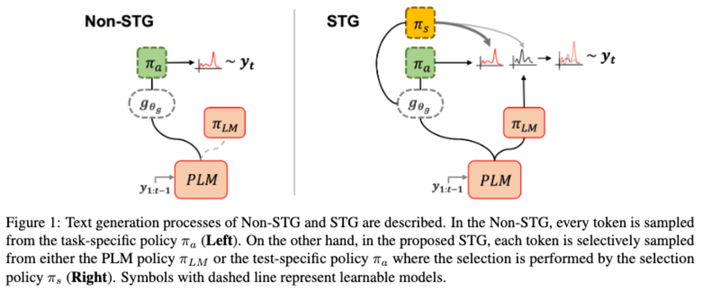

[](https://aclanthology.org/2022.coling-1.510/)
[](https://arxiv.org/abs/2209.08206)
# Official implementation of Selective Token Generation for Few-shot Natural Language Generation (COLING'22)

<p align="center">
    
</p>


## Requirements
- torch == 1.8.1
- nltk == 3.5
- rouge-score == 0.04
- transformers == 4.3.2

## Dataset Preparation
#### QA
1. download [this repo](https://github.com/microsoft/MSMARCO-Question-Answering) into *qa/src*
    ```
    > git clone https://github.com/microsoft/MSMARCO-Question-Answering qa/src
    ```
2. download MSMARCO QA dataset from https://microsoft.github.io/msmarco/
3. preprocess data by using this [script](../notebooks/msmacro_split.ipynb)
4. change root_dir of [QADataset](./data_loader.py#L278) to the corresponding directory 

#### Summarization
1. download [this repo](https://github.com/SKRohit/Generating_Text_Summary_With_GPT2) into *summ/src*
    ```
    > git clone https://github.com/SKRohit/Generating_Text_Summary_With_GPT2 summ/src
    ```
2. download and preprocess dataset following [Dataset Preparation](https://github.com/SKRohit/Generating_Text_Summary_With_GPT2#dataset-preparation) of the repo
3. change root_dir of [SummDataset](./data_loader.py#L162) to the corresponding directory 

## Experiments 
1. specify -e [experiment_name] in below instructions (e.g. -e qa)
    - qa (Question Answering)
    - summ (Summarization)

2. specify -d [domain_name] in below instructions (e.g. -e qa -d 1)
    - qa: 1, 05, 01, 001, 005 (2,000, 1,000, 500, 100, and 50 shot respectively)
    - summ: CNN, CNN05, CNN01, CNN003, CNN001 (3,000, 1,500, 300, 100, and 50 shot respectively)

## Instructions 
1. fine-tune GPT
    ```
    > python [experiment_name]/train.py --domain [domain_name] --seed [seed_number]
    ```
2. train
- NonSTG-MLE
    ```
    > python -m torch.distributed.launch --nproc_per_node=1 --master_port [PORT] train.py --world_size 1 --num_workers 2 -e [experiment_name] -d [domain_name] --seed [seed_number] -m ftg --obj mle 
    ```
- NonSTG-RL
    ```
    > python -m torch.distributed.launch --nproc_per_node=1 --master_port [PORT] train.py --world_size 1 --num_workers 2 -e [experiment_name] -d [domain_name] --seed [seed_number] -m ftg --obj rl
    ```
- STG
    ```
    > python -m torch.distributed.launch --nproc_per_node=1 --master_port [PORT] train.py --world_size 1 --num_workers 2 -e [experiment_name] -d [domain_name] --seed [seed_number] -m stg --obj rl 
    ```
3. generation & evaluation 
- PLM
    ```
    > python -m torch.distributed.launch --nproc_per_node=8 --master_port [PORT] eval_[experiment_name].py --world_size 8 --num_workers 8 -m ft -d [domain_name] --seed [seed_number]
    ```
- NonSTGs
    ```
    > (QA) python -m torch.distributed.launch --nproc_per_node=8 --master_port [PORT] eval_qa.py --world_size 8 --num_workers 8 -m rl -cp [checkpoint_path] --score sample -n 3
    > (summ) python -m torch.distributed.launch --nproc_per_node=8 --master_port [PORT] eval_summ.py --world_size 8 --num_workers 8 -m rl -cp [checkpoint_path] --score beam -n 3
    ```
- STG 
    ```
    > (QA) python -m torch.distributed.launch --nproc_per_node=8 --master_port [PORT] eval_qa.py --world_size 8 --num_workers 8 -m rl -cp [checkpoint_path] --score sample -n 3 --scheme cat
    > (summ) python -m torch.distributed.launch --nproc_per_node=8 --master_port [PORT] eval_summ.py --world_size 8 --num_workers 8 -m rl -cp [checkpoint_path] --score beam -n 3
    ```
- Naive Ensemble (available in NonSTG)
 
  specify --inj_scheme [max, mix, random] in the instruction of evaluation of NonSTGs 


## Citation

```
@inproceedings{jo-etal-2022-stg,
    title = "Selective Token Generation for Few-shot Natural Language Generation",
    author = "Jo, Daejin and Kwon, Taehwan and Kim, Eun-Sol and Kim, Sungwoong",
    booktitle = "Proceedings of the 29th International Conference on Computational Linguistics",
    publisher = "International Committee on Computational Linguistics",
    url = "https://aclanthology.org/2022.coling-1.510",
    pages = "5837--5856"
}
```

## Contact

If you have any questions, feel free to contact me via [email](mailto:daejin.jo@kakaobrain.com).
